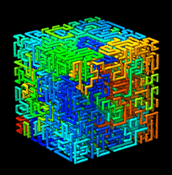
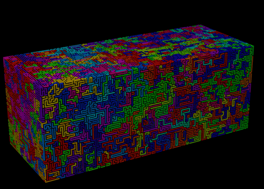

ndmansfield
===========
## Typical usage

    ndmansfield -box xsize ysize zsize -tsave tsave [options] > traj.raw

## Example

    ndmansfield -box 10 10 10 -tsave 2000 -tstop 20000 | tail -n 1001 > traj.raw

##  Description

"ndmansfield" is a simple program which
generates random self-avoiding space-filling curves
(also called "lattice Hamiltonian paths")
in an arbitrary number of dimensions 
using the algorithm developed by Marc L. Mansfield:
       (Mansfield, M.L., J. Chem Phys, 2006, 125(15):154103)
Essentially, this program packs a random snake-like chain into a box.
In order to do this, the program runs a Monte-Carlo simulation
which generates a series of curves.  As the simulation progresses,
the curves become increasingly random and independent of the starting shape.
The coordinates for the shapes of these curves are saved as 3-column
(n-column) numeric text files (eg "traj.raw") containing xsize\*ysize\*zsize
lines per curve, and blank lines as delimiters between new curves.
Cyclic curves can also be generated.  (See details below.)

The curves are assumed to be completely flexible,
however stiffness and twist preferences can be introduced
using the "-bend-energy" and "-twist-energy" arguments:

For more details, including a complete list of options, see the
"docs_ndmansfield.txt" file in the "doc" subdirectory.
(The move-set used during the Monte-Carlo procedure is explained in the file
 "doc/images/Mansfield_monte-carlo_move_JCP2006_Fig1.png",
as well as in the Mansfield paper.)

NOTE: The initial shape of the curve is included in the file generated by this
program (which is *not* random).  To skip this useless shape and save only
the random shape at the end of the simulation, use "tail", to save the last N+1
lines of the file (as shown in the example above;
here "N" is xsize\*ysize\*zsize; the +1 is for the delimiter.)

## Moltemplate interoperability

This program was originally used to generate initial coordinates for polymer melt simulations using MOLTEMPLATE and LAMMPS.  (The coordinates it generates can be converted into moltemplate files using the genpoly_lt.py script distributed with moltemplate.  Curve interpolation beforehand (for example using interpolate_curve.py) is recommended.)  Below, a coarse-grained DNA polymer is wrapped along a curve generated by ndmansfield:

    

## Running Time
The total running time necessary to generate a random curve is
estimated to be O(n^2).  (The number of iterations
necessary to generate a random curve was estimated
to grow as O(n) with the length of the curve.
And the running time per iteration is O(n).)
The curves shown above have a length over 300000
and were generated in a few minutes.

## Compilation

## Linux:

    cd src
    source setup_gcc_linux.sh
    make

(If you are not using the bash shell, enter "bash" into the terminal beforehand)

## Windows 10:

Install the Windows Subsystem for Linux (WSL) and run

    sudo apt-get install build-essential

and then follow the instructions above for linux.
(Older windows users can install Cygwin or MinGW.)

## Apple:

    cd src
    source setup_gcc_OSX.sh
    make

## Dimensionality:

ndmansfield can generate random paths in dimensions
other than 3 by changing the number of integers following the "-box" argument.

Example in 2-D:
    ndmansfield -box 20 20 -tsave 1000 -tstop 15000 | tail -n 401 > traj.raw

Example in 4-D:
    ndmansfield -box 10 10 10 10 -tsave 20000 -tstop 200000 | tail -n 626 > traj.raw

(If you use the -startcrd argument, you will have to change the number of
columns in your file accordingly.)

## License

ndmansfield is available under the terms of the open-source 3-clause BSD 
license.  (See `LICENSE.md`.)

